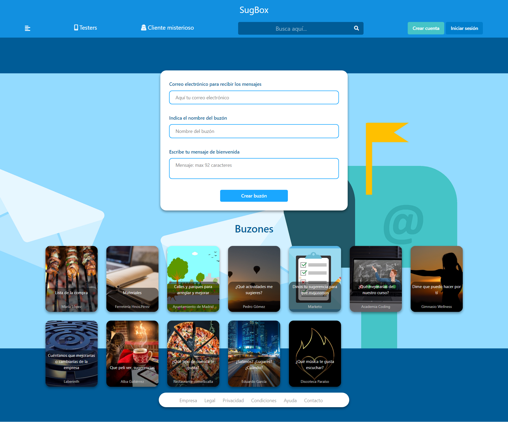
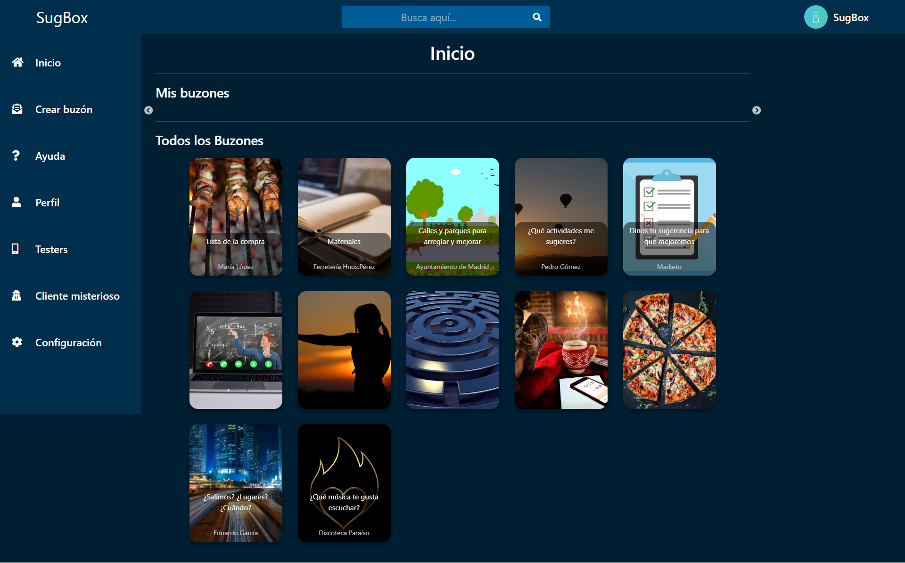
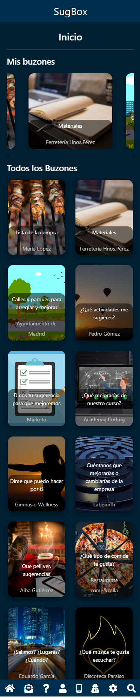

# SugBox

## About The Project

SugBox es una aplicación que he creado como idea de buzones de sugerencia, usando las tecnologías de Bootstrap, JQuery, Slick CSS, además de HTML, CSS y JavaScript. Este proyecto es solo una idea, sobretodo de diseño, y no tiene ninguna función. Está adaptado a distintos dispositivos.

-------------------------------------------------------------------------------

SugBox is an application that I have created as a suggestion box idea, using the technologies of Bootstrap, JQuery, Slick CSS, in addition to HTML, CSS and JavaScript. This project is just an idea, especially design, and has no function. It is adapted to different devices.

## Website screenshot

    

    

    

## Contact

Guillermo Pérez - [LinkedIn](https://linkedin.com/in/guillermo-perez-fuentes)